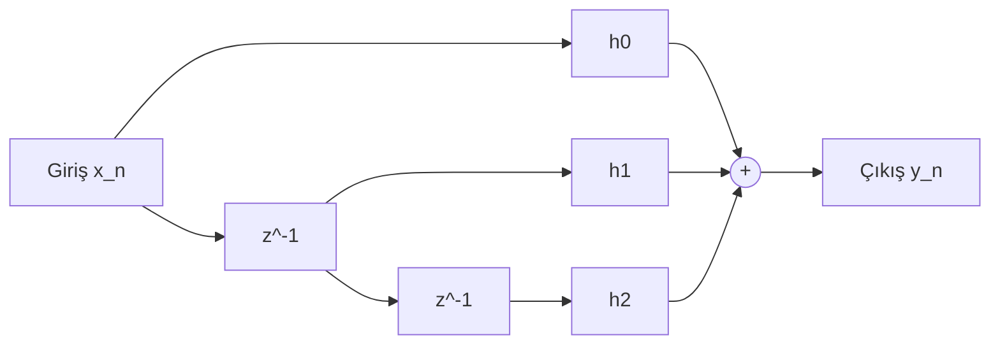

# 01 — FIR Nedir?

## Problem

Dijital sinyal işleme sistemlerinde ölçülen veya örneklenen sinyal çoğu zaman yalnızca ilgilendiğimiz bilgiyi içermez.

Bir sinyal içerisinde:

- istenmeyen frekans bileşenleri,
- gürültü,
- girişim,
- DC bileşeni,
- aliasing kaynaklı bileşenler

bulunabilir.

Bu nedenle bir proje içerisinde sinyalin belirli frekans bileşenlerini geçirmek veya bastırmak gerekebilir.

Sayısal filtreler, bu amaçla ayrık zamanlı (-ing. discrete time) sinyal üzerinde matematiksel bir dönüşüm gerçekleştiren bir sistemdir.

## Mathematical Foundation

FIR filtre esasında bir konvolüsyon filtresidir. Ayrık zamanlı konvolüsyonun matematiksel tanımı şu formülle ifade edilir:

$$y[n] = \sum_{k=0}^{N-1} x[k]h[n-k]$$

$N$: Number of coefficients / taps

Örneğin 4-tap FIR:

$$
y[n] =
h[0]x[n]
+h[1]x[n-1]
+h[2]x[n-2]
+h[3]x[n-3]
$$

**Örnek**: Giriş sinyalimiz $x[n]$ ($n = 0$'dan $8$'e kadar 9 elemanlı) ve dürtü yanıtımız $h[n]$ ($n = 0$'dan $3$'e kadar 4 elemanlı) olduğu için, $n$'in her bir değeri ($0$ ile $11$ arası, 9+4-1=12 elemanlı) için geçerli olan toplam açılımları şu şekildedir:

* **$y[0] = x[0]h[0]$**
* **$y[1] = x[0]h[1] + x[1]h[0]$**
* **$y[2] = x[0]h[2] + x[1]h[1] + x[2]h[0]$**
* **$y[3] = x[0]h[3] + x[1]h[2] + x[2]h[1] + x[3]h[0]$**
* **$y[4] = x[1]h[3] + x[2]h[2] + x[3]h[1] + x[4]h[0]$**
* **$y[5] = x[2]h[3] + x[3]h[2] + x[4]h[1] + x[5]h[0]$**
* **$y[6] = x[3]h[3] + x[4]h[2] + x[5]h[1] + x[6]h[0]$**
* **$y[7] = x[4]h[3] + x[5]h[2] + x[6]h[1] + x[7]h[0]$**
* **$y[8] = x[5]h[3] + x[6]h[2] + x[7]h[1] + x[8]h[0]$**
* **$y[9] = x[6]h[3] + x[7]h[2] + x[8]h[1]$**
* **$y[10] = x[7]h[3] + x[8]h[2]$**
* **$y[11] = x[8]h[3]$**

### Mantığı Nedir?

* Dürtü yanıtı $h[n]$ aynada ters çevrilip ($h[-k]$ olur) sağa doğru kaydırılır.
* Her bir $n$ anında, $x$ ile $h$'in üst üste çakıştığı indisler birbiriyle çarpılır ve elde edilen çarpımlar toplanarak o noktadaki çıkış değeri ($y[n]$) bulunur.

## Engineering Intuition

> Sezgisel mantık nedir? (Bu denklem fiziksel dünyada veya sinyalde ne anlama geliyor?)

FIR filter'ı ilk aşamada bir **ağırlıklı geçmiş kaydı** olarak düşünmek faydalıdır.

Filtre yalnızca mevcut sample'a bakmaz. 

Geçmiş sample'ları da saklar:

```text
x[n]       x[n-1]       x[n-2]       x[n-3]
 │            │            │            │
 ×h[0]       ×h[1]       ×h[2]       ×h[3]
 │            │            │            │
 └────────────┴────────────┴────────────┘
                     │
                    SUM
                     │
                     ▼
                    y[n]
```

Her geçmiş sample'ın çıkış üzerindeki etkisi ilgili coefficient tarafından belirlenir.

Bu nedenle FIR'ı şu şekilde özetleyebiliriz:

"**Geçmişteki belirli sayıdaki input sample'ı al, her birine bir ağırlık uygula ve bunları topla.**"

Bu yorum matematiksel denklemin hardware açısından anlaşılmasını kolaylaştırır.

Örneğin:

$$h=[0.25,0.5,0.25]$$

ise:

$$
0.25x[n]
+
0.5x[n-1]
+
0.25x[n-2]
$$

olur.

Burada ortadaki sample daha yüksek ağırlığa sahiptir.

## Hardware Interpretation

algoritma karşılığı:



## Sources

## Engineering Takeaway

1. FIR'ın temelinde **discrete-time convolution** bulunur.
2. Bu matematiksel yapı bize geçmiş input samples'ın belirli coefficients ile ağırlıklandırılarak toplandığını söyler.
