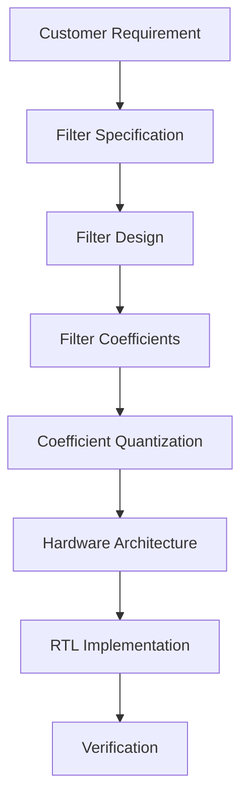

# FIR Filter Specifications

## Problem

Bir FIR filter tasarımında başlangıç noktası coefficient dizisi değildir.

Bir müşteri genellikle "_Bana şu coefficient'lere sahip bir filtre yap._" demez.

Bunun yerine filtrenin hangi sinyalleri geçirmesini, hangilerini bastırmasını ve bu işlemi hangi toleranslarla gerçekleştirmesini tanımlar.

Örneğin bir müşteri aşağıdaki beklentiyi verebilir:

```markdown
Sampling Frequency : 100 MHz
Passband           : 0 – 10 MHz
Passband Ripple    : ≤ 0.1 dB
Stopband           : 20 – 50 MHz
Stopband Attenuation: ≥ 80 dB
```

Bu specification doğrudan bir hardware architecture tarif etmez.

Önce bu gereksinimlerden uygun bir FIR filtre tasarlanmalı, ardından elde edilen filter coefficients bir hardware architecture ile gerçekleştirilmelidir.

Temel engineering flow:


## Mathematical Foundation

### Sampling Frequency

Discrete-time sistemin sampling frequency'si $F_s$ ile gösterilir. Nyquist frequency $F_N = \frac{F_s}{2}$ şeklindedir.

Örneğin:


$F_s = 100\text{ MHz}$ ise $F_N = 50\text{ MHz}$

Dolayısıyla temel low-pass filter specification'ımız:

```markdown
0 MHz                                      50 MHz
│-------------------------------------------│
             Discrete-time spectrum
```
üzerinde tanımlanır.

### Passband

Passband, filtrenin istenen sinyalleri mümkün olduğunca az bozarak geçirmesi beklenen frequency region'dır.

Örneğin:  $0 \leq f \leq 10\text{ MHz}$ için $|H(f)| \approx 1$ istenebilir.

Gerçek bir filter'da ideal olarak tam olarak 1 olmak yerine belirli bir tolerans tanımlanır.

### Passband Ripple

Passband içerisinde magnitude response'un ideal response çevresindeki dalgalanması passband ripple olarak adlandırılır.

Örneğin: $R_p \leq 0.1\text{ dB}$ şeklinde bir requirement verilebilir.

Bu durumda passband içerisindeki response'un belirtilen sınırlar içerisinde kalması gerekir.

### Stopband

İstenmeyen frequency components'ın bastırılması gereken bölgedir.

Örneğin: $20\text{ MHz} \leq f \leq 50\text{ MHz}$ stopband olarak tanımlanabilir. İdeal durumda $|H(f)|=0$ istenir.

Pratikte bunun yerine minimum attenuation belirlenir.

### Stopband Attenuation

Stopband attenuation, filtrenin stopband içerisindeki sinyalleri ne kadar bastırması gerektiğini ifade eder.

Amplitude ratio için: $$A_{dB}=20\log_{10}\left(\frac{A_{out}}{A_{in}}\right)$$ kullanılır. Örneğin 80 dB attenuation için $$20\log_{10}(A)=-80$$ $$A=10^{-4}$$ elde edilir. Yani amplitude yaklaşık olarak: $\frac{1}{10000}$ seviyesine indirilmelidir.

### Transition Band

Passband ile stopband arasında kalan frequency region:

$$f_p < f < f_s$$

transition band olarak adlandırılır.

Örneğin:

```
0          10          20                    50 MHz
│──────────│───────────│─────────────────────│
 PASSBAND  TRANSITION       STOPBAND

Passband    = 0–10 MHz
Transition  = 10–20 MHz
Stopband    = 20–50 MHz
```

Transition band içerisinde response'un belirli bir ideal değeri koruması beklenmez. Filtrenin passband'den stopband'e geçişini gerçekleştirdiği bölgedir.

## Engineering Intuition

Bir FIR filter tasarımının zorluğunu yalnızca tap sayısı belirlemez. Filter specification'ın ne kadar sıkı olduğu büyük önem taşır.

Özellikle:

- daha dar transition band,
- daha yüksek stopband attenuation,
- daha düşük passband ripple

genellikle daha yüksek filter order ve dolayısıyla daha fazla coefficient/tap gerektirir.

Örneğin iki tasarımı düşünelim:

```
Filter A
Passband : 0–10 MHz
Stopband : 30 MHz+

Filter B
Passband : 0–10 MHz
Stopband : 11 MHz+

Filter B'nin transition band'i çok daha dar olduğu için aynı ripple ve attenuation hedeflerini karşılamak daha zor olabilir.
```

Bu durum filter design ile hardware architecture arasında doğrudan bir bağlantı kurar.

## Hardware Interpretation

coefficient sayısı arttığında temel arithmetic workload da artar.

N tap'li bir FIR'ın naif implementation'ında yaklaşık olarak:
- N multiplier
- N−1 adder

Coefficient symmetry, constant-coefficient multiplication, pipelining, folding, time-multiplexing ve DSP block kullanımı gibi teknikler resource kullanımını değiştirebilir. Bu nedenle:

$$\boxed{\text{Number of taps} \neq \text{Number of physical multipliers}}$$

## Sources

## Engineering Takeaway