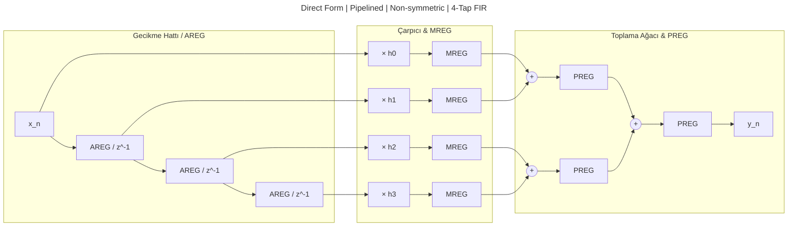
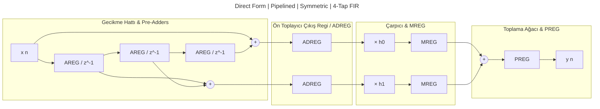
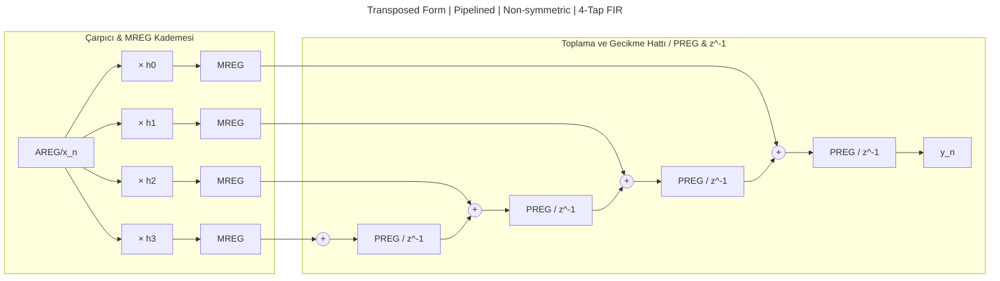
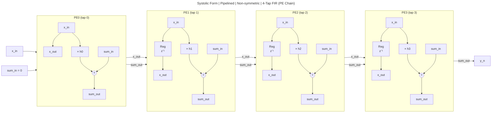

# FIR Hardware Architecture

## Problem

FIR imp için çeşitli mimariler ve yaklaşımlar söz konusudur. Bu dökümanda mimariler incelenecektir.

## Mimariler

> ileride yeni mimarilerde eklenir. Şimdilik bunlar yeterli: direct (non-symmetric + symmetric) transpose(non-symmetric), sistolik(non-symmetric)

Aşağıdaki mimariler değerlendirmeye alınmıştır.

```text
FIR Filtre Mimarileri
│
├── 1. Direct Form
│   └── Tap delay line → çarpanlar → adder tree
│
├── 2. Transpoze Direct Form
│   └── Giriş broadcast → her tap'te çarpan + toplama
│       (DSP48 cascade'e uygun, en yaygın FPGA tercihi)
│
├── 3. Simetriye göre
│   ├── Non-symmetric
│   │   └── General FIR (linear phase yok, h[n] ≠ ±h[N-1-n])
│   ├── Symmetric (h[n] = h[N-1-n])
│   │   ├── Type I  — N tek  (odd length)
│   │   │   ├── Davranış: w=0 ve w=π'de sıfır zorunluluğu yok
│   │   │   └── Kullanım: en esnek tip — LP/HP/BP/BS her türlü filtre tasarlanabilir
│   │   └── Type II — N çift (even length)
│   │       ├── Davranış: w=π'de zorunlu sıfır
│   │       └── Kullanım: LP filtre için ideal, HP filtre için uygun değil
│   └── Antisymmetric (h[n] = -h[N-1-n])
│       ├── Type III — N tek  (merkezde h=0)
│       │   ├── Davranış: w=0 ve w=π'de zorunlu sıfır; 90° faz kayması
│       │   └── Kullanım: BP filtre ve differentiator'larda kullanılır
│       └── Type IV  — N çift (even length)
│           ├── Davranış: w=0'da zorunlu sıfır; 90° faz kayması
│           └── Kullanım: Hilbert transformer ve differentiator'larda tercih edilir, LP filtre için uygun değil
│
├── 4. Folded
│   └── Time multiplexing 
│
├── 5. Systolic Array
│   └── Local interconnect, komşu PE'ler arası veri + kısmi toplam
│       (Yüksek Fmax, ASIC routing congestion'ına iyi)
│
├── 6. Multiplierless (sabit/compile-time katsayı gerektirir)
│   ├── CSD (Canonic Signed Digit)
│   │   └── Shift-add zinciri (LUT/adder, DSP kullanmaz)
│   └── Distributed Arithmetic (DA)
│       └── Bit-seri + önceden hesaplanmış LUT
│
├── 7. Polyphase
│   └── Multi-rate (decimation/interpolation) için faz alt-filtrelere bölme
│
├── 8. Coefficient Configuration
│   ├── Fixed (compile-time) coefficients
│   │   └── Sentez zamanında sabitlenir — ROM/sabit-çarpıcı optimizasyonu, CSD/DA burada mümkün
│   └── Runtime-programmable coefficients
│       └── Çalışma zamanında yüklenebilir — coefficient RAM + genel amaçlı çarpıcı gerekir, Multiplierless (6) ile uyumsuz
│
```

```text
                              FIR
                               │
          ┌────────────────────┼────────────────────┐
          │                    │                    │
          ↓                    ↓                    ↓
       Direct              Transposed             Systolic
          │                    │                    │
     ┌────┴────┐          ┌────┴────┐          ┌────┴────┐
     │         │          │         │          │         │
     ↓         ↓          ↓         ↓          ↓         ↓
  Normal  Symmetric    Normal  Symmetric    Normal  Symmetric
     │         │          │         │
     └────┬────┘          └────┬────┘
          │                    │
          ↓                    ↓
     Folded (opt.)       Folded (opt.)
```

### 1. Direct Form






### 2. Transposed Form



> `Transposed Form | Pipelined | Symmetric | 4-Tap FIR` farklı bir mevzu. İleride geri dönüp bakılır. İlk etapta pas. (V2 konusu)

## 3. Folded Architecture

- Folding Factor (N): Bir fonksiyonel birimin kaç işlemi sırayla yaptığı.
    - Folding factor = 1 → tamamen parallel (unfolded)
    - Folding factor = K → K işlem tek çarpan/toplayıcıda sırayla yapılır

> ileride detaylandırılacak

## 5.6 Systolic Mimari

```text
                  ┌─────────────────────┐
  x_in  ─────────►│                     │─────────► x_out
                  │   PE (Processing    │
  sum_in ────────►│      Element)       │─────────► sum_out
                  │                     │
                  └─────────────────────┘
                            ▲
                            │
                    h (katsayı - sabit)
```

